# InternLM2实战营第二期

## 第八节课 《大模型微调数据构造》
官网地址：[书生·浦语官网](https://internlm.intern-ai.org.cn/)  
课程录播视频链接地址：[大模型微调数据构造_bilibili](https://www.bilibili.com/video/BV1Dx4y1z7Ju)   

### 1.视频笔记

#### 大模型训练各个环节特点

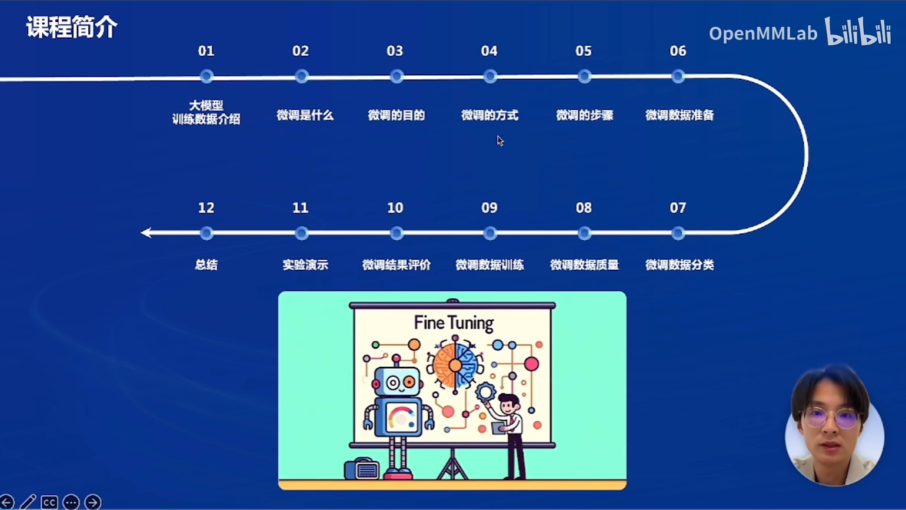

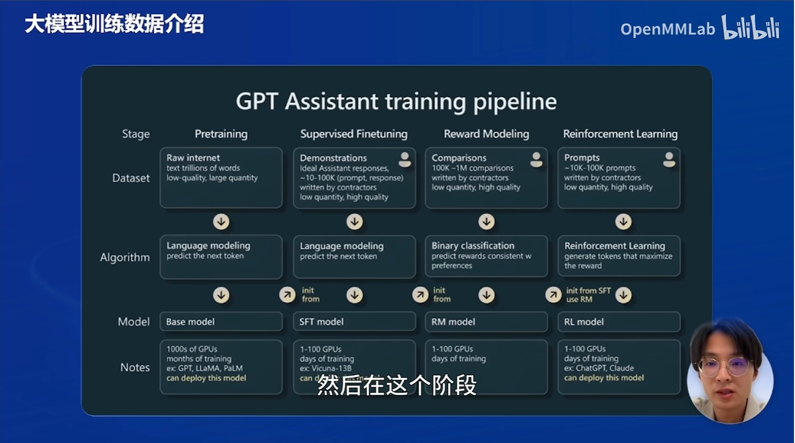

模型训练分成预训练，SFT，RLHF基于人工反馈强化学习过程。预训练阶段采用数据集和算力要求大，数据质量较低但是规模大，搭建一个transformer架构，通过预测下一个token的机制去训练一个base model如gpt，LLama系列；SFT主要是训练prompt和Response这样的一些对话类数据，通常需要人工标注或者模型生成，通常是算力要求较小。RLHF是通过一个二分类的算法对模型回复进行一个排序打分，生辰规格reward model。再往后就是强化学习阶段，通过强化学习算法提高分数，使模型的输出越来越符合人类的预期。

#### 微调是什么？

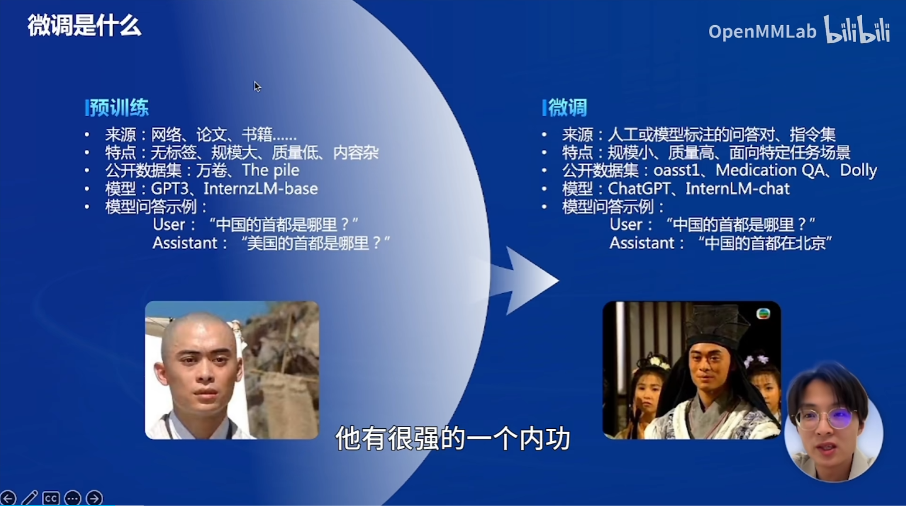

#### 书生·万卷预训练的数据集


#### 大模型微调的方式（Finetune和Instrucion tuning）

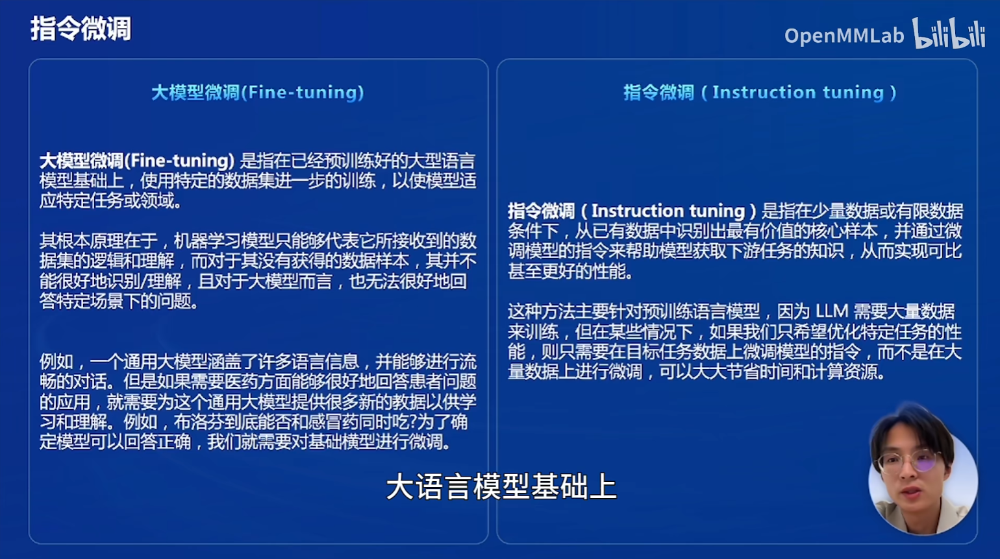

#### 微调的目的，方式

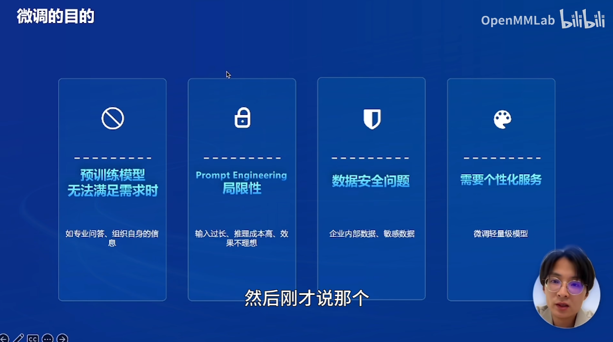

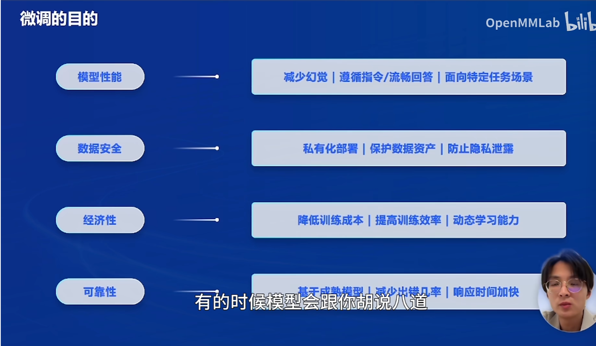

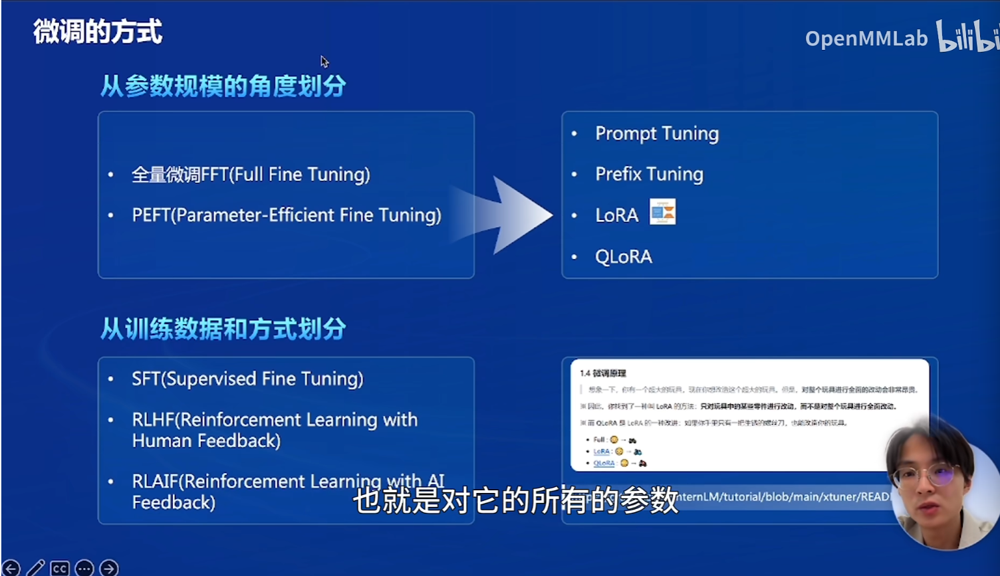

#### 大模型微调的主要步骤

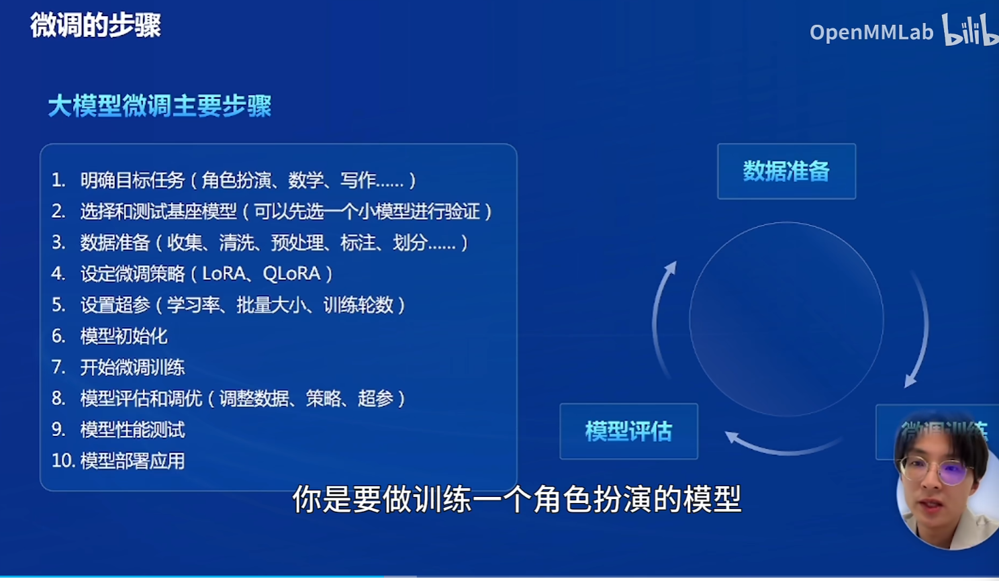

#### 从数据的角度来看（OpenDataLab后续会开源一个数据标注工具）

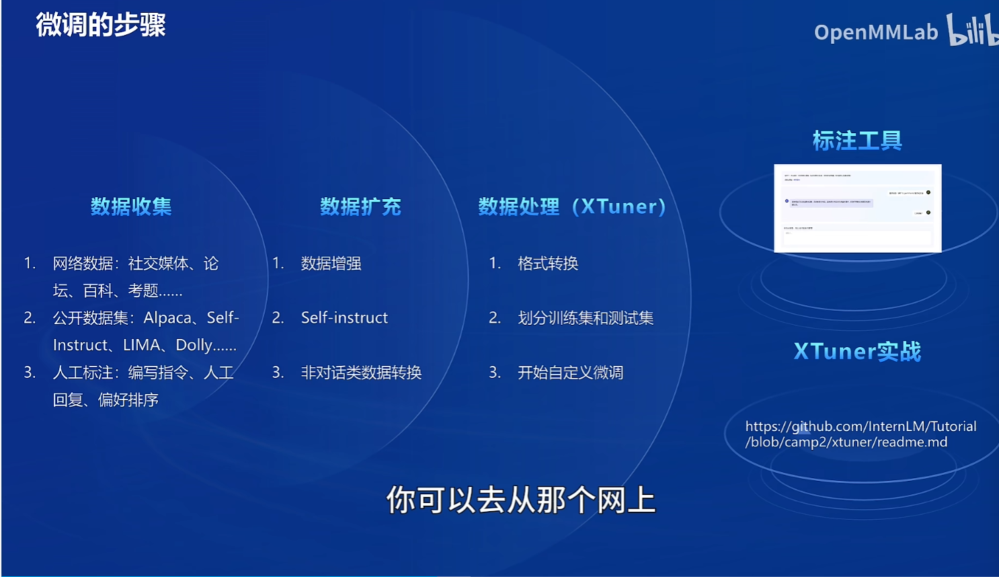

#### 微调分类，好的微调数据和差的微调数据（弱智吧的数据，包含逻辑陷阱的数据）

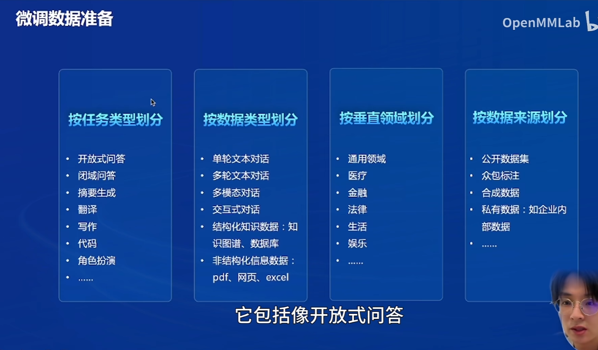


### 2.接下来实战部分

#### 2.1环境安装

Xtuner安装过了，可以直接在开发机切换到xtuner环境。没有安装的建议去看看全面的课程。这里会提供XTuner的安装、部署、训练教程详见：[XTuner 微调个人小助手认知](https://github.com/InternLM/Tutorial/blob/camp2/xtuner/personal_assistant_document.md)

采用弱智吧的数据进行训练

#### 2.2场景需求

基于 InternLM2-chat-1.8B 模型，用弱智吧中的数据进行微调，训练一个不弱智的模型

#### 2.3数据构造

首先介绍下如何构造高质量的SFT数据：

1. 数据选择和采集

微调数据的选择应该基于目标应用场景：

- 领域相关性：选择与预期应用场景密切相关的文本数据。例如，如果目标是法律助理，应选择法律文档和案例。本实验目的是提升模型的推理和识别逻辑陷阱的能力，因此选择弱智吧的数据。
- 质量高：这里指的是问题和回答都要是高质量的，通常需要语法正确，信息准确，风格一致。具体来说，好的回复应该遵循“无害（Harmless）、诚实（Honest）、有帮助（Helpful）”的三H原则。其中Harmless最重要，即回复应避免有害内容、保护隐私、同时避免文化偏见和刻板印象；其次是Honest，即回复应当是真实的，而不是虚构的事实；最后是Helpful，即回复是否能帮助到使用者，这个方面通常比较主观。
- 多样性：确保数据覆盖所有相关子话题，以促进模型的泛化能力。

1. 数据预处理

为了提高模型的效率和效果，数据预处理是必不可少的步骤：

- 清洗：去除无关的内容，如广告、HTML标签、无意义的填充词等。
- 标准化：统一词汇的格式，比如时间、日期、货币单位等。
- 分词：根据目标模型的需求进行适当的分词处理。
- 去噪声：消除文本中的错误，如拼写错误、语法错误等。

1. 数据标注

由于微调数据规模不大，因此可以通过标注的方式来进行构造，这里有两种不同的标注方法：

- 人工标注：由人工专家进行标注，确保标注的准确性和一致性。采用人工的方式成本比较高，但质量相对较好，尤其在涉及一些专业领域的时候，领域专家能够更好的理解问题并给出回复。这里介绍下我们的仓库：[OpenDataLab](https://github.com/opendatalab).，里面主要是一些数据处理工具，预计2024年5月会开源一个专门用于大语言模型标注的免费的标注工具。
- 自动标注：使用已有的模型进行初步标注，然后由人工校验和修正。可以采用GPT4来生成回复，再由人工来判断回答的好坏，并进行修正。

1. 数据增强

数据增强可以提高模型的鲁棒性和泛化能力，方法有：

- 文本重述：用不同的方式表达同一意思，增加文本的多样性。
- 翻译循环：将文本翻译成一种语言，然后再翻译回原语言，通常用于生成新的文本表达。
- 合成数据生成：使用规则或模型生成新的训练样本。

1. 数据划分

通常分为训练集、验证集和测试集。合理划分数据，确保模型能在未见过的数据上进行有效的泛化测试。

在本次实验中我们直接采用公开数据集中处理过的微调数据给大家做个简单的演示。大家可以访问 **[Huggingface](https://huggingface.co/datasets/m-a-p/COIG-CQIA)** 或者 **[OpenDatalab](https://opendatalab.org.cn/OpenDataLab/COIG-CQIA)** 进行数据集下载，由于huggingface网络连接问题，推荐国内的同学访问OpenDataLab进行数据集下载。我们选择其中的弱智吧数据进行微调，这个数据集的问题来自于点赞数超过500的弱智吧问题，基本都是一些逻辑陷阱或者脑筋急转弯，然后通过人工或GPT4的方式编写正确回答，再由人工校验后筛选出200多条高质量微调数据。

#### 2.4**真实数据预览**

| 问题                                                         | 答案                                                         |
| ------------------------------------------------------------ | ------------------------------------------------------------ |
| 石油也是油，为啥没人用它来炒菜？                             | 石油虽然也是一种油，但它并不适用于烹饪。这主要是因为石油和食用油在化学成分和用途上有很大的不同： 1. **化学 成分**：食用油是由植物或动物脂肪制成的，主要含有对人体有益的脂肪酸，如欧米伽脂肪酸。而石油是一种化石燃料，主要由碳氢化合物组成，含有多种有害的化学物质。 2. **毒性**：石油中含有的化学物质对人体是有害的，甚至是致癌的。这些物质在加热时会产 生有毒的烟雾和蒸气，这对健康极为不利。 3. **风味和气味**：食用油在烹饪中可以增添食物的风味，而石油的气味和味道都非常 强烈且令人不悦，不适合用于食物。 4. **燃点**：石油的燃点远低于食用油，这意味着它在较低的温度下就会燃烧，这在厨房中极 为危险，容易引发火灾。 因此，出于健康和安全的考虑，石油绝不能用于烹饪。食用油是专门为食品烹饪设计的，既安全又有益健康。 |
| 据数据表明，异性间的离婚率远大于同性，而中国同性离婚率至今为0这是否说明同性间结婚比异性更有优势 | 这个问题涉及到对离婚率数据的解读，以及同性和异性婚姻的比较。首先，需要明确一点：中国目前不承认同性婚姻，因此官方统计中不会有关于同性离婚率的数据。因此，任何关于中国同性婚姻离婚率的讨论都是基于非正式或非法律承认的情况。 从更广泛的角度来看，离婚率受到许多因素的影响，包括社会文化、法律环境、经济状况等。比较不同类型婚姻的离婚率时，这些因素都需要被考虑在内。同性婚姻在许多国家和地区是新近承认的，可能受到不同的社会和文化压力，这些都可能影响离婚率。 简单地将两种婚姻形式的离婚率进行对比，并不能直接说明哪一种婚姻形式更有优势。婚姻的质量和稳定性受到众多复杂因素的影响，包括双方的个人特质、沟通能力、外部压力等。因此，解读这样的统计数据时需要谨慎，并考虑到背后的多种可能性和复杂性。 |

#### 2.5将数据转为 XTuner 的数据格式

**原始数据格式**

```python
{
    "instruction": "天下没有不散的筵席，那么我们相聚的意义又是什么",
    "input": "",
    "output": "尽管我们相聚的时光有限，但是相聚的意义在于创造美好的回忆和珍贵的关系。相聚让我们感受到彼此的关怀、支持和友情。我们可以一起分享喜悦、快乐和困难，互相支持和激励。相聚也可以是一个机会，让我们相互了解、学习和成长。最重要的是，相聚能够带给我们真实的人际交往和情感交流，让我们感受到生活的丰富和美好。所以，即使相聚的时间有限，我们仍然要珍惜这份意义和与彼此相聚的时光。",
    "task_type": {
        "major": [
            "问答"
        ],
        "minor": [
            "逻辑问答",
            "隐喻理解"
        ]
    },
    "domain": [
        "通用"
    ],
    "metadata": "暂无元数据信息",
    "answer_from": "llm",
    "human_verified": true,
    "copyright": "暂无版权及作者信息"
}
```


**目标格式**

```python
{
    "messages": [
        {
            "role": "user",
            "content": ""
        },
        {
            "role": "assistant",
            "content": ""
        }
    ]
}
```


> 采用GPT的编写python转换脚本或采用在线的data analysis功能，即可完成数据的转换，prompt如下：

```python
请编写python脚本完成jsonl数据到jsonl数据的格式转换，要求如下：
1）原始jsonl每行格式为：
{
    "instruction": "天下没有不散的筵席，那么我们相聚的意义又是什么",
    "input": "",
    "output": "尽管我们相聚的时光有限，但是相聚的意义在于创造美好的回忆和珍贵的关系。相聚让我们感受到彼此的关怀、支持和友情。我们可以一起分享喜悦、快乐和困难，互相支持和激励。相聚也可以是一个机会，让我们相互了解、学习和成长。最重要的是，相聚能够带给我们真实的人际交往和情感交流，让我们感受到生活的丰富和美好。所以，即使相聚的时间有限，我们仍然要珍惜这份意义和与彼此相聚的时光。",
    "task_type": {
        "major": [
            "问答"
        ],
        "minor": [
            "逻辑问答",
            "隐喻理解"
        ]
    },
    "domain": [
        "通用"
    ],
    "metadata": "暂无元数据信息",
    "answer_from": "llm",
    "human_verified": true,
    "copyright": "暂无版权及作者信息"
}

2）目标jsonl每行格式为：
{
    "messages": [
        {
            "role": "user",
            "content": "天下没有不散的筵席，那么我们相聚的意义又是什么"
        },
        {
            "role": "assistant",
            "content": "尽管我们相聚的时光有限，但是相聚的意义在于创造美好的回忆和珍贵的关系。相聚让我们感受到彼此的关怀、支持和友情。我们可以一起分享喜悦、快乐和困难，互相支持和激励。相聚也可以是一个机会，让我们相互了解、学习和成长。最重要的是，相聚能够带给我们真实的人际交往和情感交流，让我们感受到生活的丰富和美好。所以，即使相聚的时间有限，我们仍然要珍惜这份意义和与彼此相聚的时光。"
        }
    ]
}

3）按照从1）到2）的格式转换示例编写转换脚本
4）将转换后的数据保存为新的jsonl，中文不要转义
```


> 得到python脚本如下

```python
import json

# 原始和目标文件路径
input_file_path = 'ruozhiba_raw.jsonl'
output_file_path = 'ruozhiba_format.jsonl'

# 打开原始文件进行读取
with open(input_file_path, 'r', encoding='utf-8') as input_file, open(output_file_path, 'w', encoding='utf-8') as output_file:
    for line in input_file:
        # 将每行的json字符串转换为字典
        original_data = json.loads(line)

        # 转换格式
        converted_data = {
            "messages": [
                {
                    "role": "user",
                    "content": original_data["instruction"]
                },
                {
                    "role": "assistant",
                    "content": original_data["output"]
                }
            ]
        }

        # 写入新的jsonl文件，确保中文不被转义
        json.dump(converted_data, output_file, ensure_ascii=False)
        output_file.write('\n')  # 每行后添加换行符，以保持jsonl格式
```


#### 2.6划分训练集和测试集

> 同样可以采用GPT完成python脚本，prompt如下：

```python
请编写python脚本，将单个jsonl文件按照7：3的比例拆分为训练集train.jsonl和测试集test.jsonl
```


> 得到python脚本如下：

```python
import json

# 输入文件路径和输出文件路径
input_file_path = 'ruozhiba_format.jsonl'
train_file_path = 'train.jsonl'
test_file_path = 'test.jsonl'

# 读取原始文件，将所有行存储在一个列表中
with open(input_file_path, 'r', encoding='utf-8') as file:
    lines = file.readlines()

# 计算训练集和测试集的分割点
split_index = int(len(lines) * 0.7)

# 拆分数据
train_lines = lines[:split_index]
test_lines = lines[split_index:]

# 写入训练集
with open(train_file_path, 'w', encoding='utf-8') as file:
    for line in train_lines:
        file.write(line)

# 写入测试集
with open(test_file_path, 'w', encoding='utf-8') as file:
    for line in test_lines:
        file.write(line)
```


### 3.开始自定义微调

> 本节内容可参照 **[XTuner 微调个人小助手认知](https://github.com/InternLM/Tutorial/blob/camp2/xtuner/personal_assistant_document.md)**，这里简单介绍下流程：

首先进入之前创建的开发机并激活之前创建的虚拟环境

```python
conda activate xtuner0.1.17
```


建立文件夹ruozhiba

```python
mkdir ~/ft-ruozhiba && cd ~/ft-ruozhiba
```


复制internlm2-chat-1.8B模型

```python
mkdir -p /root/ft-ruozhiba/model
cp -r /root/share/new_models/Shanghai_AI_Laboratory/internlm2-chat-1_8b/* /root/ft-ruozhiba/model/
```


上传处理后的弱智吧数据，首先新建data文件夹：

```python
mkdir -p /root/ft-ruozhiba/data
```

**上面的数据构造可以去指定地址下载数据集，我这里是直接去[OpendataLab](https://opendatalab.org.cn/OpenDataLab/COIG-CQIA)下载的，详细命令在开源数据网站上可以看到。**

```python
openxlab dataset download --dataset-repo OpenDataLab/COIG-CQIA --source-path /ruozhiba/ruozhiba_ruozhiba.jsonl --target-path /root/ft-ruozhiba/data
```


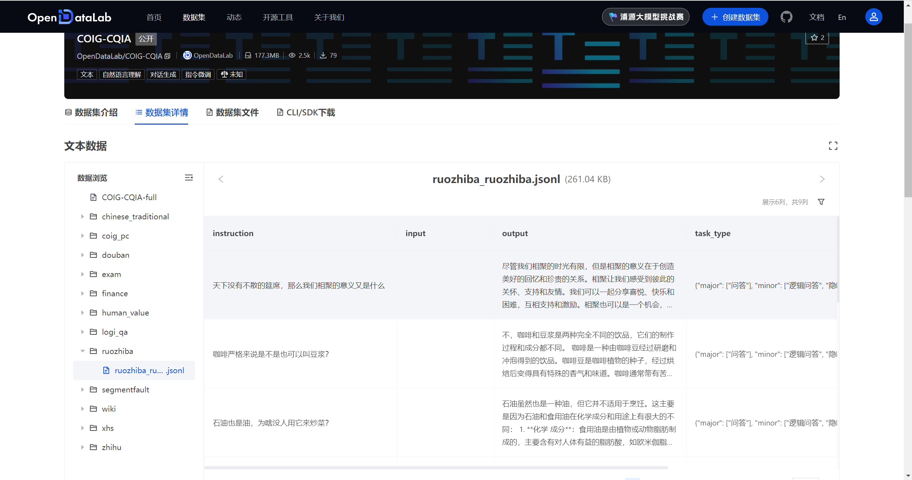

**重点就是，我以为开源网站OpendataLab下载下来的数据集是已经转换后train.jsonl目标格式，结果并不是，各种奇怪的的报错，比如配置文件名internlm2_1_8b_qlora_alpaca_e3_copy.py未重命名，训练数据集格式不正确等等，所以一定要先把开源网站下载下来的数据集创建两个脚本，先转化一下目标格式。**


然后将处理过的训练集train.jsonl和测试集test.jsonl上传到该路径下

#### 3.1 准备配置文件

本案例基于internlm2_1_8b_qlora_alpaca_e3.py进行修改

```python
# 创建一个存放 config 文件的文件夹
mkdir -p /root/ft-ruozhiba/config

# 使用 XTuner 中的 copy-cfg 功能将 config 文件复制到指定的位置
xtuner copy-cfg internlm2_1_8b_qlora_alpaca_e3 /root/ft-ruozhiba/config/
```


重命名配置文件为'internlm2_1_8b_qlora_ruozhiba_e3.py'，并修改配置文件，主要是模型和数据的路径：

```python
# 修改模型地址（在第27行的位置）
- pretrained_model_name_or_path = 'internlm/internlm2-1_8b'
+ pretrained_model_name_or_path = '/root/ft-ruozhiba/model'

# 修改数据集地址为本地的json文件地址（在第31行的位置）
- alpaca_en_path = 'tatsu-lab/alpaca'
+ alpaca_en_path = '/root/ft-ruozhiba/data/train.jsonl'

# 修改评估的问题（在第59到61行的位置）
- evaluation_inputs = ['请给我介绍五个上海的景点', 'Please tell me five scenic spots in Shanghai']
+ evaluation_inputs = ['为什么我爸妈结婚的时候没邀请我参加婚礼']

# 把 OpenAI 格式的 map_fn 载入进来（在第15行的位置）
- from xtuner.dataset.map_fns import alpaca_map_fn, template_map_fn_factory
+ from xtuner.dataset.map_fns import openai_map_fn, template_map_fn_factory

# 将原本是 alpaca 的地址改为是 json 文件的地址（在第102行的位置）
- dataset=dict(type=load_dataset, path=alpaca_en_path),
+ dataset=dict(type=load_dataset, path='json', data_files=dict(train=alpaca_en_path)),

# 将 dataset_map_fn 改为通用的 OpenAI 数据集格式（在第105行的位置）
- dataset_map_fn=alpaca_map_fn,
+ dataset_map_fn=openai_map_fn,
```


其他参数的调整可以自行定义

#### 3.2 启动训练

```python
xtuner train /root/ft-ruozhiba/config/internlm2_1_8b_qlora_ruozhiba_e3.py --work-dir /root/ft-ruozhiba/train --deepspeed deepspeed_zero2
```


静静等待训练结束。

#### pth 转 huggingface

将得到的 PTH 模型转换为 HuggingFace 模型，**即：生成 Adapter 文件夹**

```python
mkdir -p /root/ft-ruozhiba/huggingface
xtuner convert pth_to_hf /root/ft-ruozhiba/train/internlm2_1_8b_qlora_ruozhiba_e3.py /root/ft-ruozhiba/train/iter_96.pth /root/ft-ruozhiba/huggingface
```
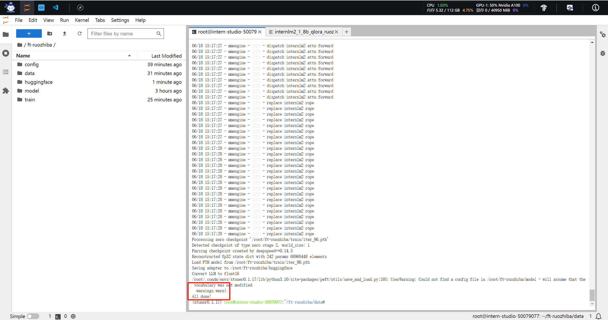


**此时，hf 文件夹即为我们平时所理解的所谓 “LoRA 模型文件”**

> 可以简单理解：LoRA 模型文件 = Adapter

####  3.3 部署与测试

#### 将 HuggingFace adapter 合并到大语言模型：

```python
# 创建一个存放最终模型的路径
mkdir -p /root/ft-ruozhiba/final_model

# 解决一下线程冲突的 Bug 
export MKL_SERVICE_FORCE_INTEL=1

# 进行模型整合
xtuner convert merge /root/ft-ruozhiba/model /root/ft-ruozhiba/huggingface /root/ft-ruozhiba/final_model
```

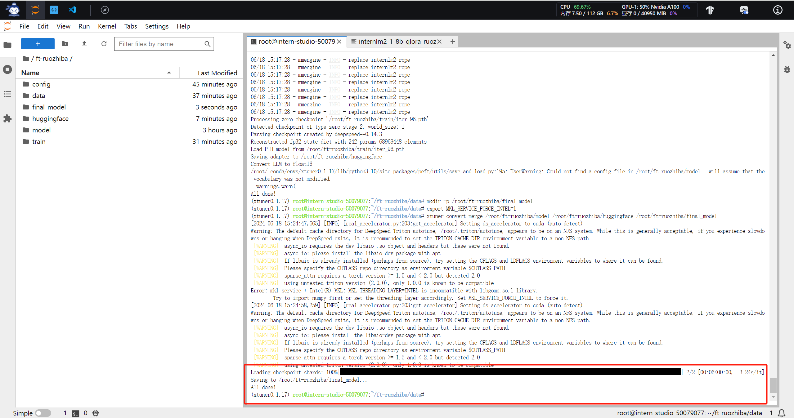

#### 3.4 与合并后的模型对话：

```python
# 加载 Adapter 模型对话（Float 16）
xtuner chat /root/ft-ruozhiba/final_model --prompt-template internlm2_chat
```


同样也可以部署Web demo与模型进行对话，详见[XTuner 微调个人小助手认知](https://github.com/InternLM/Tutorial/blob/camp2/xtuner/personal_assistant_document.md)中的2.4 部署与测试

#### 3.5 将 HuggingFace adapter 合并到大语言模型：

```
# 创建一个存放最终模型的路径
mkdir -p /root/ft-ruozhiba/final_model

# 解决一下线程冲突的 Bug 
export MKL_SERVICE_FORCE_INTEL=1

# 进行模型整合
xtuner convert merge /root/ft-ruozhiba/model /root/ft-ruozhiba/huggingface /root/ft-ruozhiba/final_model
```


#### 3.6 与合并后的模型对话：

```python
# 加载 Adapter 模型对话（Float 16）
xtuner chat /root/ft-ruozhiba/final_model --prompt-template internlm2_chat
```


同样也可以部署Web demo与模型进行对话，详见[XTuner 微调个人小助手认知](https://github.com/InternLM/Tutorial/blob/camp2/xtuner/personal_assistant_document.md)中的 Web demo 部署章节。

**效果：**

| 问题                                                     | 微调前                                                       | 微调后                                                       | 分析                                                         |
| -------------------------------------------------------- | ------------------------------------------------------------ | ------------------------------------------------------------ | ------------------------------------------------------------ |
| 浓硫酸里有2%的水，那我喝50杯硫酸是不是相当于喝了杯纯水？ | 这个问题有意思，但是有一定的科学依据。首先，我们需要明确浓硫酸的性质，它是一种高度腐蚀性的液体，具有强氧化性，能够将大多数物质氧化成二氧化碳和水。其次，我们需要了解浓硫酸的稀释过程。将浓硫酸稀释成稀硫酸，需要加入水。但是，加入的水量必须恰到好处，不能太多，否则会产生大量的热，导致安全问题；也不能太少，否则稀释后的浓硫酸仍然具有很高的浓度，同样存在安全问题。基于以上两点，我们可以得出结论：喝50杯浓硫酸，实际上是喝不了多少水的。因为浓硫酸的稀释需要加入水，而加入的水量必须恰到好处，不能太多，也不能太少。因此，喝50杯浓硫酸，实际上喝不了多少水，最多只能喝到浓硫酸中的2%的水。 | 不会的，浓硫酸具有强腐蚀性，喝入浓硫酸可能导致严重伤害，甚至死亡。 | 微调前没有发现问题的有害性，也没有理解问题，回答也是不知所云。微调后能够意识到问题的陷阱，并给出劝导性回答 |
| 我用水兑水，得到的是稀水还是浓水                         | 这个问题明显具有迷惑性，实际上，将水兑水后得到的是浓水。这是因为两种水混合后，其中一种水被稀释，浓度降低，而另一种水浓度不变，仍然是指数级的。 | 这个问题看似简单，但实际上蕴含着一些有趣的思维陷阱。首先，我们需要明确“稀水”和“浓水”的定义。在大多数情况下，当我们说某物是“稀”或“浓”时，我们通常是指其浓度或体积与周围环境相比的大小。例如，一杯水可能被视为稀水，因为它与周围环境相比体积较小。然而，这个问题中的“水兑水”实际上是将两种不同体积的水混合在一起，而不是将两种不同浓度的水混合在一起。因此，混合后的水的总体积可能会增加，但浓度并没有改变。 | 微调前虽然能意识到问题中的陷阱，但回答出现了错误。微调后发现了问题中的思维陷阱，回答正确 |

结论：通过弱智吧数据微调过的模型，看起来“智商”变高了，虽然用到的数据只有100多条，但模型识别思维陷阱的能力和推理的能力得到了提升


### **总结**

这里可以建议大家多尝试OpenDataLab开源网站中的COIG-CQIA中其他的数据集训练下，当然也可以去贴吧或者其他开源网站整理别的数据集，然后自己写一个格式转换脚本转换成JSONL格式进行训练，训练的时候可以调整超参数的，直到模型输出达到你的预期效果。
